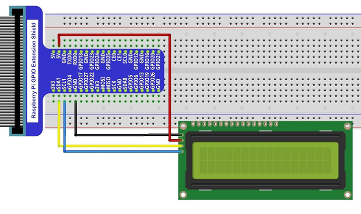
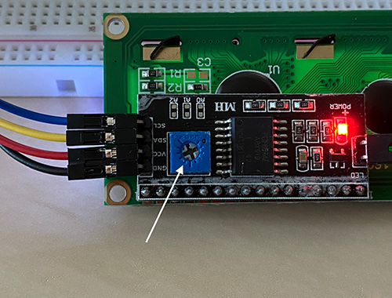
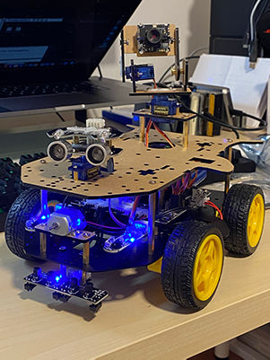
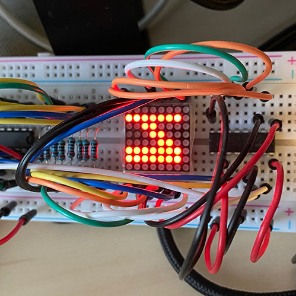
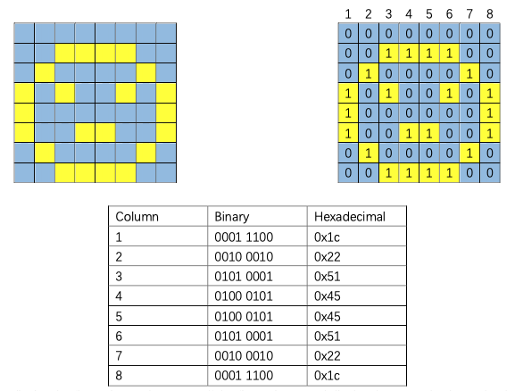
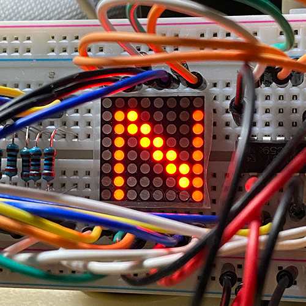

# EE 629 IoT Weekly Reports
## Final Project: Pi Weather Information Screen
### Component List
* Raspberry Pi (with 40 GPIO)
* GPIO Extension Board & Ribbon Cable
* Breadboard
* Jumper Wires
* I2C LCD1602 Module
### Circuit
<br>
The I2C LCD1602 Display Screen integrates a I2C interface. The default I2C address is 0x27(0x3F). To view the Raspberry Pi bus on the I2C device address through command
```
i2cdetect -y 1
```
Refer to [2020-11-02] for configure I2C and install Smbus.
### Demo
Display weather on 1602 LCD using I2C and observatory API.<br>
<br>
#### [2020-11-23]
Rotating the grey knob as shown below to adjusts the contrast of the LCD screen.<br>
<br>
Display realtime CPU temperature and time.<br>
<br>

#### [2020-11-16]
* Completed Blockchain demos<br>
* 4WD Raspberry Pi Robot. (Orginal plan for the final project) - Assembled the robot. Retuned the tracking module sensors and light seeking module sensors<br>
<br>

#### [2020-11-09]
* Installed Pyang, PlantUML, GIMP, Pinta, and ran the demos on Raspberry Pi<br>

#### [2020-11-02]
* Installed Python packages which introduced at lession 8 on Mac and Raspberry Pi<br>
* Installed XQuartz on Mac for SSH -Y<br>
* Ran Data Analysis Python demo codes<br>
### Thermometer<br>
Components: Thermistor, ADC module, Jumper wires, and Resistors 10kΩ.<br>
* Enable I2C and Installed I2C tools:<br>
```
sudo raspi-config
``` 
* Choose “5 Interfacing Options” then “P5 I2C” then “Yes” and then “Finish” in this order and restart Raspberry Pi<br>
* Check whether the I2C module is started:<br>
```
lsmod | grep i2c
```
* Install I2C-Tools:<br>
```
sudo apt-get install i2c-tools
```
* I2C device address detection:<br>
```
i2cdetect -y 1
```
* Install Smbus Module:
```
sudo apt-get install python3-smbus
```
#### [2020-10-26]
* Logged in ThingSpeak using MathWorks account. Created cpu_loop channel<br>
* Created rpidata project with Google Drive and Sheets API and credentials on Google Cloud Platform<br>
* Installed gspread, oauth2client, and psutil on Raspberry Pi<br>
* Ran and tested lab programs<br>
#### [2020-10-19] 
• Signed up an Particle account<br>
• Installed Particle-Agent on Raspberry Pi and logged into the Particle account<br>
• Added Raspberry Pi device in the Particle account<br>
• Original link of the Particle Mobile App in the lecture slides does not work. Found supporting document: https://docs.particle.io/tutorials/developer-tools/tinker/photon/<br>
• Installed Particle iOS app and connected to Raspberry Pi<br>
• Installed node.js and npm on Raspberry Pi<br>
Step 1: Update Pi<br>
```
sudo apt-get update
```
Step 2: Identify Architecture Version of Raspberry Pi 3 /3B+: ARMv7<br>
Step 3: Copy the ARMv7 download link at NodeJS downloads page<br>
Step 4: Go to terminal to download NodeJS Binaries<br>
```
Wget https://nodejs.org/dist/v12.19.0/node-v12.19.0-linux-armv7l.tar.xz 
```
Step 5: Extract the downloaded file<br>
```
tar -xf node-v12.19.0-linux-armv7l.tar.xz
```
Step 6: Copy the files to a directory in PATH<br>
```
cd node-v12.19.0-linux-armv7l
sudo cp -R * /usr/local/
```
Step: 6: Check if installation was successful<br>
```
pi@raspberrypi:~ $ node -v
v12.19.0
```
```
pi@raspberrypi:~ $ npm -v
6.14.8
```
* Installed PARTICLE CLI
* Installed Node-RED and run on http://localhost:1880
* Run node lesson 6 hello.js
* Server running at http://127.0.0.1:8080/
* Inspected the webpage. Less than 200ms loading time. Favicon.ico loads after
* Run node http.js
* Installed node.js, npm, Particle-CLI, and Atom on laptop
* Installed MATLAB on Android phone. Toggled on all of the sensors and moving around the phone, observes the data changes
#### [2020-10-13] 
Continue with the LED Matrix project.<br>
There are 8x8 LED Matrix generator tools online, but it displays in reversed and 90 degrees clockwise rotate orientation on the LED Matrix due to they are other types of LED Matrix. For example, I drew the letter "N", and the code is 0x86,0xc6,0xc6,0xe6,0xf6,0xde,0xce,0xc6, # "N" . This is how it shows on the LED.<br>
<br>
<br>
<br>
The LED Matrix I am using is a Common Anode LED Matrix. There are 8 columns. Each column is represented by one byte. In Binary, 0 is LEDs turned OFF, and 1 is LEDs turned ON. To draw a diagram, convert each column from Binary number to Hexadecimal code at here: https://www.rapidtables.com/convert/number/binary-to-hex.html , and add "0x" before the converted Hexadecimal code.<br>
Diagram below from Freenove.<br>
<br>
<br>
The correct code for letter "N": 0x00,0xFF,0x60,0x30,0x18,0x0C,0x06,0xFF, # "N".<br>
<br>
#### [2020-10-07]
LED Projects (Codes and instructions from Freenove):<br>
### Blinking Red LED
Hardware and electronic components:<br>
* Raspberry Pi 3B
* Breadboard
* GPIO Extension Board
* 220Ω Resister
* Red LED
* Jump Wires (M-M) <br>
<br>
<br>
### Display numbers and letters on LED Matrix display
Hardware and electronic components:<br>
* Raspberry Pi 3B
* Breadboard
* GPIO Extension Board
* 8x8 LED Matrix
* 220Ω Resisters
* 74HC595 DIP IC
* Jump Wires (M-M) <br>
<br>
<br>
#### [2020-09-29]
* Purchased starter kit for Raspberry Pi including breadboard and all sort of electronic components
* Reconfigured the Google Cloud due to billing issues
#### [2020-09-22]
* Installed VNC Viewer on Raspberry Pi and Mac
* Login the Wi-Fi router to see the connected devices list. The list contains the IP address of each device
* Successfully connected to Raspberry Pi using VNC Viewer and Secure Shell
* Push the Red button to talk to Google Assistant, with audio and text feedback
#### [2020-09-15]
* Reviwed the lecture and followed the instruction to configure the system settings
* Modified the Digital Clock Setting: %a  %h %d  %I:%M %p. For example it will display: Tue Sep 15 10:00 AM
* Connected Mac to the Raspberry Pi using Google Chrome extension: Secure Shell https://chrome.google.com/webstore/detail/secure-shell/iodihamcpbpeioajjeobimgagajmlibd
* Got the crdiential from Google Cloud Speech APIs https://console.cloud.google.com/
#### [2020-09-08]
* Used Etcher https://www.balena.io/etcher/ to flash the Raspbian operating system onto the MicroSD card
* Assembled Raspberry Pi 3B with the Google AIY: Voice Kit https://aiyprojects.withgoogle.com/voice/
